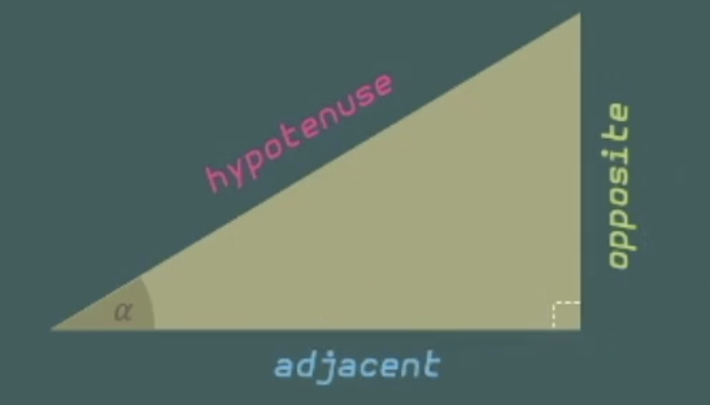

## Projected points

```
px' = px/pz
```

```
py' = py/pz
```

## Right triangles



```
sin(a) = opposite / hypotenuse
```

```
cos(a) = adjacent / hypotenuse
```

```
tan(a) = opposite / adjacent
```

mnemonic:

```
s = o/h
c = a/h
t = o/a

sohcahtoah
```

## Angles

```
cos(a + b) = cos(a)cos(b) - sin(a)sin(b)
```

```
sin(a + b) = sin(a)cos(b) + cos(a)sin(b)
```
